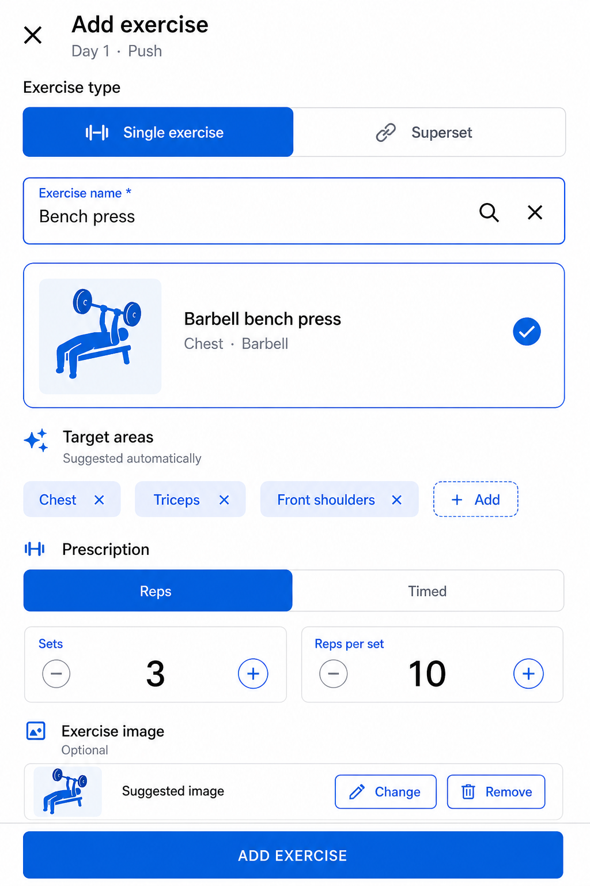
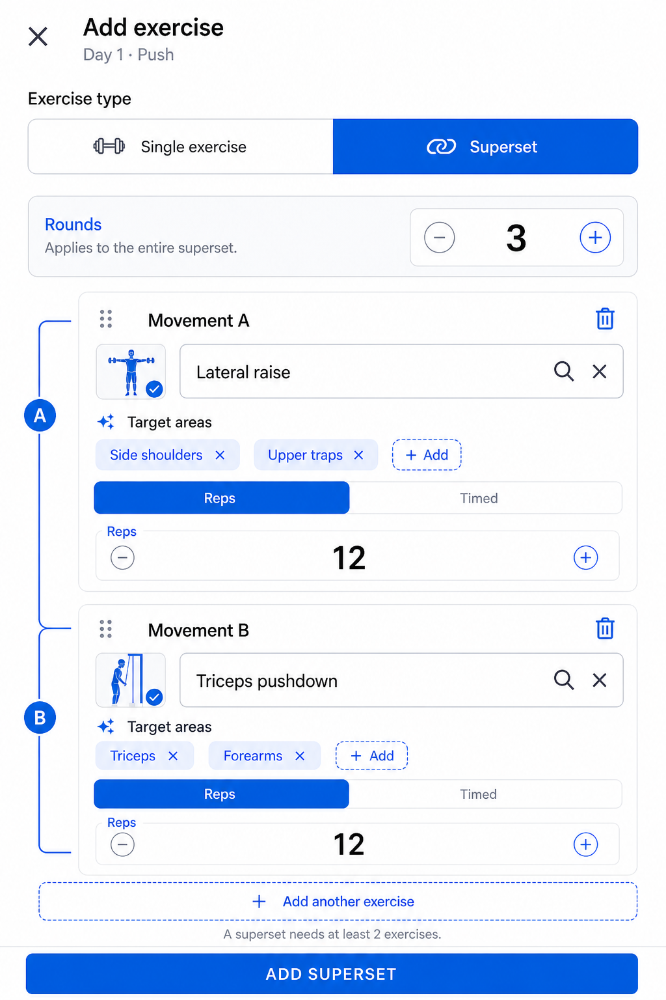

# Exercise editor

Status: product direction approved on 2026-09-07.

This document specifies the full-screen editor used to add or edit a single exercise or a superset inside the [plan-builder stepper](plan-builder-stepper.md). It records the agreed interaction, persistence, migration, and validation behavior so an implementation agent does not need to infer product decisions from mockups.

## Outcome

The Day step has one **Add exercise** action. It opens one full-screen modal editor. The user chooses **Single exercise** or **Superset** inside that editor.

This replaces:

- Separate Add exercise and Add superset buttons in the Day step.
- A chooser dialog before opening the editor.
- The current small exercise-block dialog.
- Duplicate Add actions in both the app bar and bottom action area.

The editor is a temporary modal route over the plan builder. It slides in, uses the full screen and keyboard safely, then slides away to the exact Day step that opened it.

## Confirmed product decisions

- Use a full-screen modal page, not a bottom sheet.
- Put an **X** close action in the app bar.
- Do not show an Add or Save action in the app bar.
- Keep one sticky primary action at the bottom.
- Choose **Single exercise** or **Superset** with a segmented control inside the editor.
- Default a new editor to **Single exercise**.
- A single exercise has one movement.
- A superset has at least two movements and may have more.
- Superset rounds are shared by every movement.
- Each movement keeps its own:
  - name;
  - reps or duration;
  - target areas;
  - image;
  - catalog association.
- Target areas support multiple values and are optional.
- Images are optional and belong to each movement, including movements in a superset.
- Catalog matches can suggest target areas and images.
- Custom exercise names are allowed without a catalog match.
- The bottom action commits the editor to the Day.
- Closing dirty work asks the user to discard or keep editing.

## Visual direction

The mockups communicate structure and behavior. Implementation should use the app's actual theme and shared widgets rather than copying pixels or hard-coded colors.

### Single exercise mode



### Superset mode



The **Exercise type** segmented control occupies the same position in both modes so switching does not feel like navigation.

## Entry and exit

### Entry

From an expanded Day step:

- **Add exercise** opens a new editor in Single exercise mode.
- Tapping the edit action on a single block opens the editor with Single exercise selected.
- Tapping the edit action on a superset block opens the editor with Superset selected.

Pass the Day identity and a copied editor draft. Do not mutate the stored Day block while the user is typing.

### Transition

Use the platform-appropriate full-screen modal transition. The intended mental model is:

- open: the editor slides over the builder;
- close/save: the editor slides away;
- destination: the same Day step and scroll position.

Do not navigate through Plan preview or Day preview.

### Close behavior

The **X**, system back, and back gesture have identical rules:

- No changes: close immediately.
- Dirty changes: show **Discard exercise changes?**
  - Supporting copy: **Changes made in this editor have not been added to the day.**
  - **Keep editing**
  - **Discard changes**
- Valid or invalid form data is not auto-added when closing.

The plan draft continues to auto-save outside the editor. The exercise/block draft is committed only through the bottom action.

## App bar and primary action

App bar:

- X icon with semantic label **Close exercise editor**.
- Title:
  - New: **Add exercise**
  - Editing a single: **Edit exercise**
  - Editing a superset: **Edit superset**
- Subtitle: the owning day, for example **Day 1 · Push**.
- No trailing Add/Save action.

Sticky bottom action:

- Single, new: **ADD EXERCISE**
- Superset, new: **ADD SUPERSET**
- Either edit mode: **SAVE CHANGES**

Keep the action above the keyboard and device safe area. Disable it when required validation fails.

## Exercise type selector

Show a two-option segmented control directly under the app bar:

- **Single exercise**
- **Superset**

### Switching Single → Superset

1. Preserve the current single exercise as Movement A.
2. Create an empty Movement B.
3. Move the single exercise's set count into shared Rounds.
4. Remove per-movement set controls.
5. Focus Movement B's exercise-name search.

### Switching Superset → Single

- If only Movement A contains data and the other movement drafts are empty, switch without confirmation and preserve Movement A.
- If any additional movement contains data, show **Switch to a single exercise?**
  - Copy: **Movement B and any additional movements will be removed.**
  - **Cancel**
  - **Switch and remove**
- Preserve Movement A, including its name, prescription, targets, and media.
- Convert shared Rounds to Movement A's set count.

Switching modes changes only the in-memory editor draft until the bottom action succeeds.

## Single exercise mode

The form order is:

1. Exercise name and catalog result.
2. Target areas.
3. Prescription.
4. Exercise image.

### Exercise name and catalog

- **Exercise name** is required.
- Search the offline catalog as the user types.
- Rank results using normalized title/aliases, recent choices, and the parent plan's selected goals.
- A selected result shows its name, equipment/category summary, optional thumbnail, and selected state.
- Selecting a catalog result:
  - uses the catalog's canonical title unless the user subsequently edits it;
  - suggests catalog target areas;
  - suggests catalog media;
  - stores the stable catalog exercise ID when available.

Custom names are valid. The user does not need to select a result. A custom movement:

- stores no catalog ID;
- begins with no automatic target areas unless an exact deterministic alias match exists;
- may receive manually selected target areas and media;
- remains fully startable and loggable.

Changing the text after selecting a catalog result clears the association once it no longer matches the canonical title or alias. Ask before replacing target areas or media that the user edited manually.

### Target areas

- Label: **Target areas**.
- Show **Suggested automatically** only for catalog-derived chips.
- Support zero, one, or multiple chips.
- Chips are removable.
- **Add** opens a searchable multi-select using the canonical taxonomy defined by the plan-builder spec.
- Keep target order stable and remove duplicates.
- Missing target areas do not disable the primary action.
- User-modified targets must survive changes to sets, reps, duration, and media.

### Prescription

Show a nested segmented control:

- **Reps**
- **Timed**

Rep mode:

- Sets, integer `>= 1`.
- Reps per set, integer `>= 1`.
- Duration is null.

Timed mode:

- Sets, integer `>= 1`.
- Duration, integer seconds `>= 1`.
- Reps are null.

Use stepper controls for ordinary changes and allow direct numeric entry for accessibility and large values. Reject decimal and negative values. Switching prescription type preserves the last in-memory value for each mode during the current editor session, but only the selected type is persisted.

Weight is intentionally not prescribed in this editor. Workout weight remains something the user logs during the session.

### Exercise image

- Optional.
- Suggest catalog media when available.
- Allow choosing from bundled assets or gallery using existing media-picker behavior.
- Allow removal.
- Mark whether the current media is catalog-suggested or manually selected.
- A manual media choice is never overwritten by later automatic matching without confirmation.

## Superset mode

### Shared rounds

Show one **Rounds** control before the movements:

- Integer `>= 1`.
- Applies to every movement.
- Do not show Sets inside movement cards.

The existing runtime model expects `prescribedSets` on each exercise. For the first implementation, keep that persistence shape and write the shared Rounds value into every movement's `prescribedSets`. A new schema field on `ExerciseBlock` is not required solely for the editor.

When opening a legacy superset whose movements have different set counts:

- Show an indeterminate Rounds value and an amber message:
  **This superset has different set counts. Choose rounds to apply to every movement.**
- Do not silently normalize the values.
- Require the user to choose Rounds before **SAVE CHANGES** is enabled.
- Leaving without saving preserves the legacy block unchanged.

### Movement cards

Show Movement A, Movement B, then any additional movements in order. Connect them visually so the group reads as one superset, but do not rely on the connector alone for semantics.

Each movement contains:

- Drag handle.
- Movement label.
- Remove action.
- Exercise search/catalog selection.
- Target-area chips.
- Reps/Timed selector.
- Reps or duration input.
- Optional per-movement media.

Movement labels update after reordering. Stable prescription IDs do not change.

**Add another exercise** appends an empty movement and focuses its name field.

Removal rules:

- A superset cannot be saved with fewer than two movements.
- If removing a movement would leave one, keep the draft in Superset mode and show **A superset needs at least 2 exercises**.
- Do not automatically switch to Single mode.

### Superset target summary

The Day card may show the de-duplicated union of movement target areas as a read-only summary. Editing always happens on each movement so target ownership remains clear.

## Media ownership and migration

The current model stores media on `ExerciseBlock`, which cannot represent a different image for every superset movement. Move these fields to `ExercisePrescription`:

- `svgPath`
- `mediaUri`
- `mediaSource`
- `mediaKind`

Migration:

- Single block: move block media to its only exercise.
- Superset block: move legacy block media to Movement A.
- Other movements begin without media unless deterministic catalog matching can suggest it; suggestions must not be persisted as manual choices until selected/confirmed according to normal editor behavior.
- Past sessions do not currently need prescription media for logging; do not rewrite session history.
- Update Isar models, mappers, JSON, remote DTOs, block summaries, thumbnails, and editor tests.

For a compatibility window, readers may fall back to legacy block media when exercise media is absent. New writes use per-exercise media only.

Suggested exercise JSON fields remain additive and optional. Preserve support for legacy block media during import, then map it using the migration rules.

## Validation

### Single exercise

Required before commit:

- Non-empty exercise name.
- Sets `>= 1`.
- Reps `>= 1` when Reps is selected, with duration null.
- Duration seconds `>= 1` when Timed is selected, with reps null.

### Superset

Required before commit:

- Rounds `>= 1`.
- At least two movements.
- Every movement has a non-empty name.
- Every movement has valid reps or duration according to its selected type.

Optional in both modes:

- Catalog selection.
- Target areas.
- Media.

Show field-level errors after interaction. If the user taps a disabled-looking action through accessibility or submits from the keyboard, focus the first invalid field and announce the error. Do not erase valid fields when another field fails.

## Commit behavior

When the bottom action is pressed:

1. Validate the entire editor draft.
2. Build a new `ExerciseBlock` or an edited copy.
3. Preserve existing block and prescription IDs when editing.
4. For a new block, generate IDs once at commit.
5. For a superset, copy shared Rounds to every prescription's `prescribedSets`.
6. Return the block to the Day step.
7. Insert or replace it in Day order.
8. Trigger the parent plan draft's immediate save.
9. Close the modal only after the parent accepts the block.
10. Restore the Day step and scroll the saved block into view.

If persistence fails, keep the editor open with all input intact and show **Could not save exercise. Try again.**

## Editing and deletion

- Editing uses the same unified editor.
- Existing type is selected on entry.
- Bottom action is **SAVE CHANGES**.
- Provide **Delete exercise** or **Delete superset** as a separate destructive action, not beside the primary action.
- Confirm deletion.
- Delete from the Day only after confirmation, trigger an immediate plan-draft save, then close.
- Deleting Movement A inside a superset must not change the block ID; reorder remaining movement labels.

## State and architecture

Keep an editor-draft model separate from persisted domain models. It should own:

- selected block type;
- shared rounds for Superset mode;
- ordered movement drafts;
- per-mode temporary rep/duration values;
- catalog association and suggestion provenance;
- target IDs and whether the user changed them;
- media and whether the user changed it;
- dirty state;
- validation results.

Do not make widget controllers the source of truth for persistence. The draft should be unit-testable without rendering Flutter widgets.

Suggested shape:

```dart
enum ExerciseEditorMode { single, superset }

class ExerciseBlockDraft {
  ExerciseEditorMode mode;
  int? rounds;
  List<ExerciseMovementDraft> movements;
  bool dirty;
}

class ExerciseMovementDraft {
  String? prescriptionId;
  String? catalogExerciseId;
  String title;
  PrescriptionType type;
  int? sets;
  int? reps;
  int? durationSeconds;
  List<String> targetAreaIds;
  ExerciseMediaDraft? media;
}
```

In Single mode, `sets` belongs to the one movement. In Superset mode, `rounds` is canonical in the draft and movement `sets` are ignored until the domain object is built.

## Implementation map

Likely areas to change:

- `lib/features/plans/exercise_block_dialog.dart` — replace or retire.
- New full-screen editor widgets and editor-draft/controller classes.
- `lib/features/plans/day_editor_page.dart` — open the modal and accept its result.
- `lib/features/plans/exercise_block_row.dart`
- `lib/features/plans/exercise_media_picker.dart`
- `lib/features/plans/exercise_media_picker_sheet.dart`
- `lib/features/plans/exercise_media_thumbnail.dart`
- `lib/domain/models/workout_plan.dart`
- `lib/data/isar/workout_plan.dart` and generated schema
- `lib/data/isar/mappers.dart`
- `lib/data/json_plan_importer.dart`
- `lib/data/remote/entity_dto.dart`
- exercise catalog metadata/search and goal-aware ranking
- route registration if the editor is a named modal route
- relevant unit, widget, and integration tests

Use one reusable movement form in both modes. Avoid two independent implementations that drift in validation, target-area behavior, or media handling.

## Delivery sequence

1. Introduce editor-draft and validation logic with unit tests.
2. Move media ownership to `ExercisePrescription` with compatibility migration/tests.
3. Add catalog association, target suggestions, custom-name behavior, and goal-aware result ranking.
4. Build the full-screen shell, close confirmation, and sticky primary action.
5. Build Single exercise mode.
6. Build Superset mode using the same movement form.
7. Add mode switching and legacy unequal-set handling.
8. Integrate with the Day step and plan-draft persistence.
9. Retire the old block dialog and update journeys/docs.

## Acceptance criteria

- The Day step needs only one **Add exercise** action.
- The editor opens and closes without losing the user's Day-step position.
- The type selector switches between Single exercise and Superset on the same page.
- There is no duplicate app-bar Add/Save action.
- Dirty close requires explicit discard confirmation.
- Custom exercise names can be saved.
- Catalog selection can suggest targets and media offline.
- A single exercise supports several target areas.
- Each superset movement owns independent targets and media.
- Superset rounds are shared and persisted consistently to every movement.
- A superset cannot be saved with fewer than two valid movements.
- Switching modes preserves Movement A and confirms before dropping populated additional movements.
- The editor commits only from the bottom action.
- Persistence failure keeps all editor input intact.
- Editing preserves stable IDs and does not rewrite workout history.

## Required tests

- Draft validation for both modes and both prescription types.
- Single → Superset conversion.
- Superset → Single conversion with empty and populated additional movements.
- Dirty X, system back, and gesture-back confirmation.
- Catalog selection, alias match, and custom exercise.
- Automatic target/media suggestions and preservation of manual edits.
- Multiple target areas per movement.
- Shared rounds written to every superset prescription.
- Legacy unequal-set superset requires explicit normalization.
- Add, edit, reorder, and remove superset movements.
- Per-exercise media Isar round-trip and legacy block-media migration.
- Parent Day remains unchanged until commit.
- Parent draft saves immediately after successful commit.
- Failed persistence retains editor state.
- Widget layout with keyboard, small screens, long names, and wrapped chips.

## Accessibility and responsive behavior

- Provide semantic labels for Close, mode options, increment/decrement, remove, reorder, media, and target chips.
- Minimum interactive target is 48×48 logical pixels.
- Do not encode mode or validity by color alone.
- Announce mode changes and validation summaries.
- Keep the selected movement and primary action visible when the keyboard opens.
- Chips wrap; they do not horizontally overflow.
- Movement cards remain understandable without the decorative A/B connector.
- Support text scaling without covering the sticky primary action.
