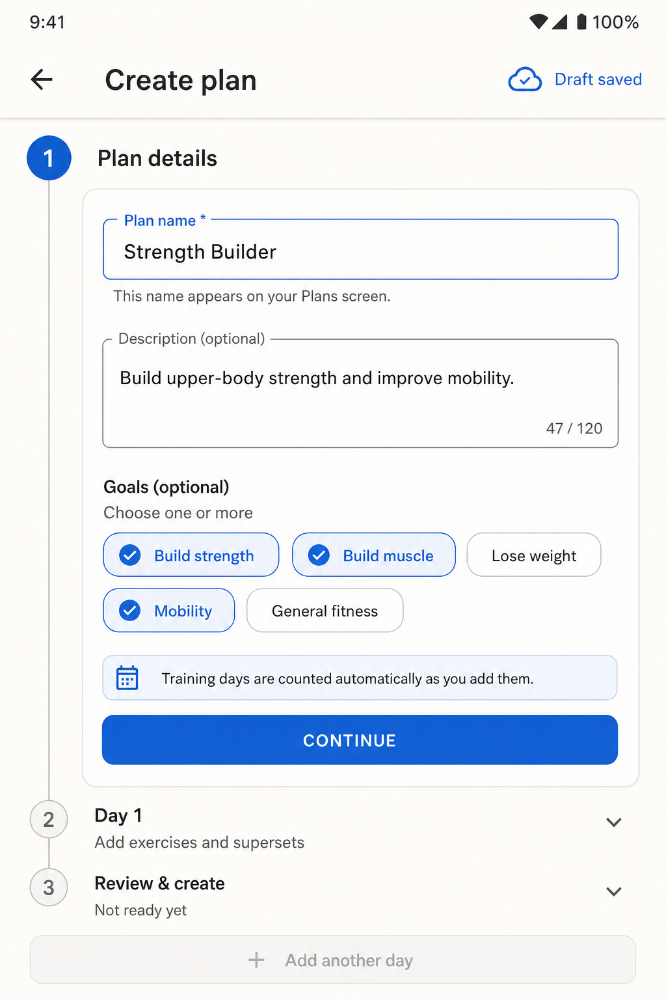
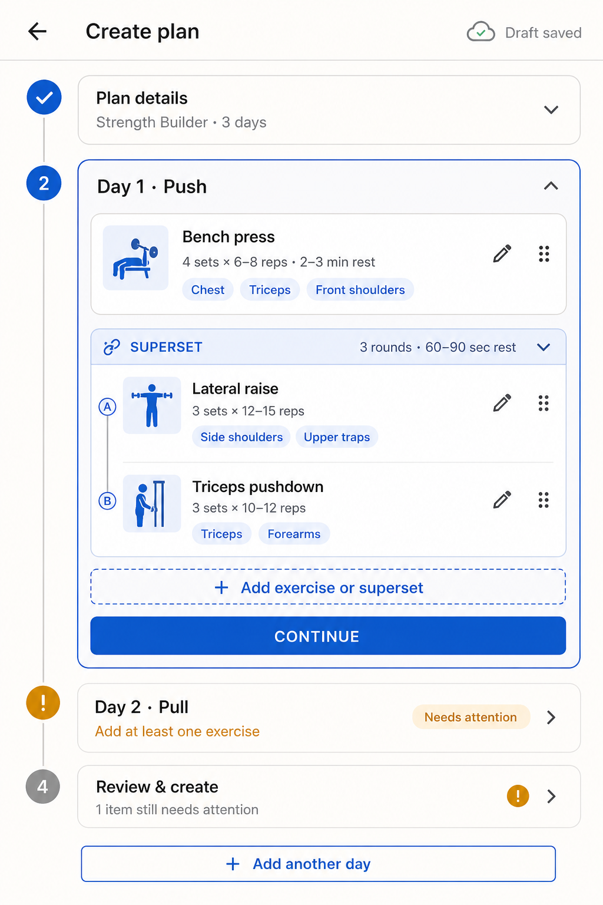
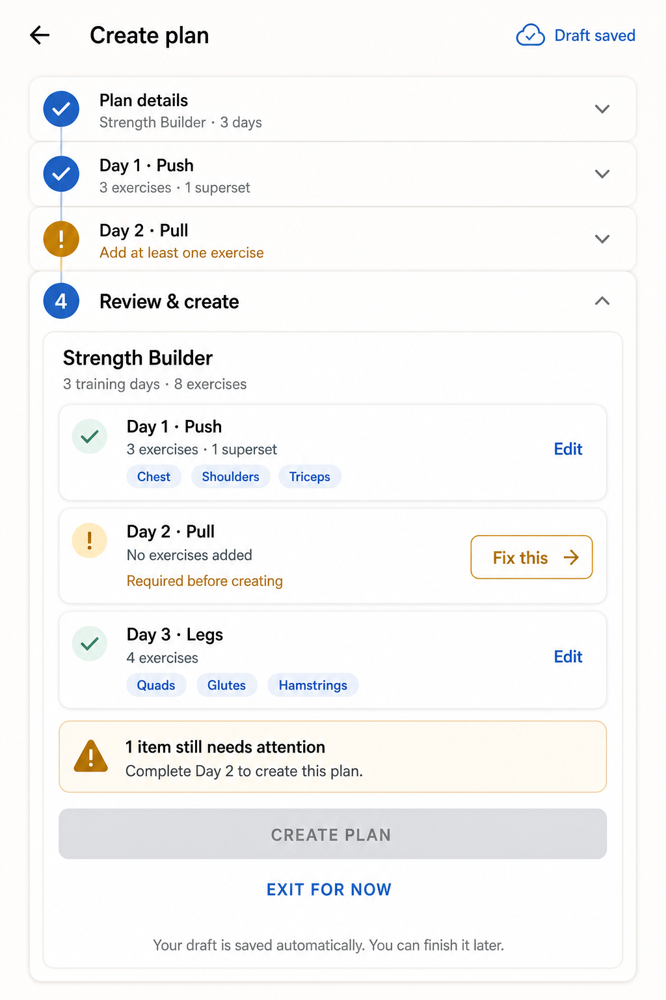

# Plan builder stepper

Status: product direction approved on 2026-09-07.

This document defines the replacement for the current multi-page create-plan flow. It is intended to be specific enough for an implementation agent to design the data migration, build the UI, and add tests without having to reconstruct the product decisions from chat.

## Outcome

Creating a plan becomes one vertical Material stepper instead of this route stack:

`New Plan → Plan preview → Day preview → Edit day → Add exercise dialog`

The user stays oriented because the plan, its days, validation state, and final review remain on one screen. Each day is a top-level step. Exercises and supersets live inside their day; individual exercises are not top-level steps.

## Confirmed product decisions

- Use a vertical Material stepper for creating a plan.
- Step 1 contains plan-level details.
- Every training day is a repeatable step.
- A day can contain single-exercise blocks and superset blocks.
- Add **Target areas** to each exercise prescription.
- An exercise can have zero, one, or several target areas.
- Exercises within a superset keep their own target areas. A superset may show the union only as a read-only summary.
- Target areas should be filled automatically when the exercise is recognized and remain editable.
- Target areas do not block plan creation if automatic matching fails.
- Remove the existing Common sections behavior completely.
- Save creation progress automatically as a draft.
- Show drafts on Plans with a **Draft** badge and **Resume** / **Delete** actions.
- Plan goals influence exercise suggestions and plan guidance; they are not decorative metadata only.
- The final review summarizes the plan and links directly to incomplete or editable steps.

## Visual direction

The images are UX references, not pixel-perfect implementation requirements. Use existing app theme tokens and widgets where they provide equivalent behavior.

### 1. Plan details



Plan details contains:

- **Plan name** — required.
- **Description** — optional, maximum 120 characters.
- **Goals** — optional multi-select.
  - Build strength
  - Build muscle
  - Lose weight
  - Mobility
  - General fitness
- An explanation that training-day count is calculated from the day steps.
- **Continue** advances to Day 1 after validating the plan name.

Do not ask for a day count. Adding and deleting day steps determines it.

### 2. Day, exercise, superset, and incomplete-state treatment



Each day step contains:

- Editable day name and optional summary.
- Ordered exercise blocks.
- A single block with one exercise, or a superset block with two or more exercises.
- Sets for a single exercise; shared Rounds for every movement in a superset.
- Exactly one prescription type per exercise: reps or duration.
- Optional media owned by each exercise, including each movement in a superset.
- Multiple editable **Target areas** chips per exercise.
- One **Add exercise** action opens the full-screen editor; the user chooses Single exercise or Superset inside it.
- Drag handles for block ordering and for movement ordering inside a superset.
- **Continue** validates and collapses the day, then opens the next incomplete step.

See [Exercise editor](exercise-editor.md) for the approved Single exercise and Superset modes, close behavior, validation, media migration, and persistence contract.

Stepper states:

- Solid blue check: complete.
- Blue numbered circle: current.
- Amber exclamation: saved but incomplete; show a precise action such as **Add at least one exercise**.
- Gray numbered circle: not started or not ready.

Amber means an incomplete draft, not a destructive error. Red remains reserved for invalid input after interaction or a failed operation.

### 3. Review and create



The review step shows a compact summary, not duplicate exercise forms:

- Plan name, day count, and total exercise count.
- One card per day.
- Exercise and superset counts.
- De-duplicated target-area chips for that day.
- **Edit** on complete days.
- **Fix this** on incomplete days.
- A total count of required issues.
- Disabled **Create plan** while required issues remain.
- **Exit for now**, with copy confirming that the draft was saved.

**Edit** and **Fix this** collapse Review and open the corresponding step in place. When all required issues are resolved, **Create plan** becomes enabled.

## Step order and interaction

The dynamic step sequence is:

1. Plan details.
2. Day 1.
3. Any additional days in plan order.
4. Review and create.

**Add another day** inserts a day immediately before Review and names it `Day N`. A newly inserted day becomes the current step. Deleting a day renumbers only default names; do not overwrite a custom day name.

Completed and incomplete steps can be opened directly. Opening one step collapses the previously open step. Continue selects the next incomplete step, or Review when all preceding steps are complete.

The system back action leaves the builder after flushing pending draft changes. If the draft contains content, return to Plans where it remains resumable. Deleting a draft requires confirmation.

## Validation rules

The builder may save incomplete data, but an active plan requires all of the following:

- Non-empty plan name.
- At least one day.
- Non-empty day name for every day.
- At least one exercise block in every day.
- Single blocks contain exactly one exercise.
- Superset blocks contain at least two exercises.
- Every exercise has a non-empty name.
- `prescribedSets >= 1`.
- Exactly one of reps or duration is set and greater than zero.

These fields are optional and never block creation:

- Plan description.
- Goals.
- Exercise media.
- Target areas.

Validation messages must state the fix, not only say that a step is invalid. Review should aggregate issues by step and navigate to the first relevant control.

## Draft behavior

Add an explicit plan lifecycle state:

- `draft` — editable in the builder; excluded from workout suggestions and cannot start a workout.
- `active` — created and available to preview and start.

Draft rules:

- Create the draft when the builder first opens, using `Untitled plan` only as list fallback text; an empty plan-name field remains invalid.
- Auto-save changed fields with a short debounce (approximately 500 ms).
- Flush immediately on Continue, back, app pause, and route disposal.
- Show a small **Saving…**, **Draft saved**, or **Could not save** status in the app bar.
- A save failure must preserve local form state and offer Retry.
- Plans lists drafts separately or alongside active plans with a clear **Draft** badge.
- Draft actions are **Resume** and **Delete**. Tapping the row resumes at the first incomplete step.
- Drafts do not contribute to Today, next-day selection, workout start, or active-plan counts.
- A draft is changed to `active` atomically when **Create plan** succeeds.
- A draft-only install should skip Welcome on later launches and land on Plans so the user can resume it.

## Target areas

### Storage

Add `List<String> targetAreaIds` to each `ExercisePrescription`, not to `ExerciseBlock` or `WorkoutPlan`.

Store stable normalized identifiers and map them to display labels, for example:

- `chest` → Chest
- `triceps` → Triceps
- `front-shoulders` → Front shoulders
- `side-shoulders` → Side shoulders
- `upper-traps` → Upper traps
- `forearms` → Forearms
- `quads` → Quads
- `glutes` → Glutes
- `hamstrings` → Hamstrings

The exercise catalog should own the canonical taxonomy. Do not persist localized display strings as identity. De-duplicate while retaining catalog/display order.

### Automatic filling

When a bundled/catalog exercise is selected or its title matches a catalog alias:

1. Fill its catalog target areas.
2. Show them as editable chips.
3. Preserve explicit user edits; changing sets, reps, duration, or media must not reset chips.
4. If the title changes to a different recognized exercise, ask before replacing manually edited target areas.
5. If no match exists, leave target areas empty and offer an **Add target area** control.

Automatic matching must work offline. An implementation may later add model-based suggestions, but the first release must use deterministic catalog data and aliases.

### Supersets

Each `ExercisePrescription` inside the superset stores its own `targetAreaIds`. The superset card may display all distinct targets as a summary, but editing that summary must route to the individual exercise chips so ownership remains unambiguous.

## Goals and suggestions

Add `List<String> goalIds` to `WorkoutPlan`. Use stable identifiers in the same way as target areas.

For the first implementation, goals affect behavior in two contained ways:

1. Rank exercise suggestions in the add-exercise experience using catalog tags appropriate to selected goals.
2. Show non-blocking guidance in Review when the plan conflicts with a selected goal, for example a mobility goal with no mobility-tagged exercise.

Guidance must not silently add, remove, or rewrite exercises. It must explain the observation and let the user open the relevant day. Goal guidance is advisory and does not disable **Create plan**.

If no goals are selected, retain neutral alphabetical/recent suggestion ordering and show no goal guidance.

## Removing Common sections

Common sections currently affect the domain model, JSON import, plan preview/editor, Today eligibility, workout-start selection, session creation, persistence mapping, remote DTOs, tests, and docs. Removal must be treated as a data migration, not only a label change.

To avoid losing existing exercises:

- Convert each existing `CommonSection` into a normal `PlanDay`.
- Preserve its title, block order, exercise IDs where safe, prescriptions, and media.
- If the plan already has a day with the same title, append ` (extras)` to the migrated day.
- Past workout sessions remain unchanged because they already snapshot their exercise logs.
- Remove the Include today sheet and all common-section selection logic for new sessions.
- After migration, remove `CommonSection` and `WorkoutPlan.commonSections` from domain and Isar models once old rows can be read and transformed safely.

Legacy JSON import:

- Continue accepting `common-plan` temporarily for backward compatibility.
- Convert each `common-plan` section to a regular day during import.
- Explain the conversion in Import preview.
- New/exported JSON should use only `basic-plan`.
- Target areas and goals should use optional additive fields so older JSON remains valid:
  - Plan: `"goals": ["build-strength"]`
  - Exercise: `"target-areas": ["chest", "triceps"]`

Remote sync DTOs need the same additive fields and lifecycle state. Coordinate schema compatibility before removing `commonSections` from payloads.

## Suggested domain shape

Names may be adapted to project conventions:

```dart
enum PlanStatus { active, draft }

class WorkoutPlan {
  String title;
  String description;
  List<String> goalIds;
  PlanStatus status;
  List<PlanDay> days;
}

class ExercisePrescription {
  String title;
  int prescribedSets;
  int? prescribedReps;
  int? prescribedDurationSeconds;
  List<String> targetAreaIds;
}
```

Keep `PlanSource` (`created` / `imported`) separate from `PlanStatus`; they describe different concerns. Put `active` first so a missing Isar byte on older rows stays startable.

## Implementation map

Primary areas expected to change:

- `lib/domain/models/workout_plan.dart`
- `lib/data/isar/workout_plan.dart` and generated schema
- `lib/data/isar/mappers.dart`
- `lib/data/json_plan_importer.dart`
- `lib/data/remote/entity_dto.dart`
- `lib/features/plans/add_plan_page.dart` — replace with the builder or route to it
- `lib/features/plans/day_editor_page.dart`
- `lib/features/plans/exercise_block_dialog.dart`
- `lib/features/plans/plans_home_page.dart`
- `lib/features/plans/plan_page.dart`
- `lib/features/plans/import_preview_page.dart`
- `lib/features/workout/start_workout.dart`
- `lib/domain/start_session.dart`
- `lib/domain/session_lifecycle.dart`
- `lib/domain/today_suggestion.dart`
- route registration and related widget/integration tests
- `docs/product-plan.md` and `docs/user-journey.md` after implementation

Prefer extracting builder state and validation from widgets so it can be unit-tested. The existing day/block editors may be reused as embedded panels or sheets, but they must not recreate the old route maze during plan creation.

## Delivery sequence

1. Add lifecycle, description, goals, and target-area fields with repository/mapping tests.
2. Add catalog target-area metadata and deterministic matching tests.
3. Implement legacy Common-section conversion and JSON compatibility tests.
4. Build draft listing, Resume/Delete, and exclusion from Today/start logic.
5. Build the stepper shell and Plan details.
6. Embed day/block editing, target chips, supersets, ordering, and day validation.
7. Build Review, issue navigation, goal guidance, and atomic activation.
8. Remove obsolete Common-section UI/session paths.
9. Update user-journey/product docs and integration flows.

## Acceptance criteria

- A user can create a complete multi-day plan without leaving the builder screen.
- The current, completed, incomplete, and untouched step states are visually distinct.
- Exiting never loses successfully saved work.
- A draft can be resumed or deleted from Plans.
- Drafts cannot appear in Today or start a workout.
- Every day must contain a valid block before activation.
- Target areas support several values per exercise, including each movement in a superset.
- Recognized exercises receive offline automatic target areas.
- Manual target-area edits survive unrelated exercise edits.
- Goals change suggestion ranking and can produce advisory Review guidance.
- Review links to the exact step needing work.
- Create remains disabled only for required validation errors.
- Existing Common-section exercises survive migration as regular days.
- Legacy `common-plan` imports remain readable and are converted visibly.
- Existing workout history is unchanged.
- Back navigation no longer requires traversing plan preview, day preview, and day editor during creation.

## Required tests

- Domain validation for each required rule.
- Isar round-trip and migration for status, description, goals, and target areas.
- Common-section-to-day migration, including title collision.
- JSON import with and without goals, target areas, and legacy `common-plan`.
- Catalog match, alias match, unknown exercise, and preservation of manual target edits.
- Draft auto-save success/failure, resume location, delete confirmation, and activation.
- Today and workout start ignore drafts.
- Widget tests for all four step states and Review issue navigation.
- Widget tests for single and superset target-area ownership.
- Integration flow: start a plan, exit, resume draft, fix an incomplete day, create, then start its workout.

## Accessibility and responsive behavior

- Do not rely on color alone: checks, numbers, warning icons, labels, and helper text identify state.
- All chips and icon actions need semantic labels and at least 48×48 logical-pixel tap targets.
- Announce auto-save failures and validation summaries to assistive technology.
- Keep the primary action reachable above the keyboard.
- Long exercise and target-area names wrap without hiding edit actions.
- Preserve step state and scroll position through keyboard opening, rotation, and app pause.
