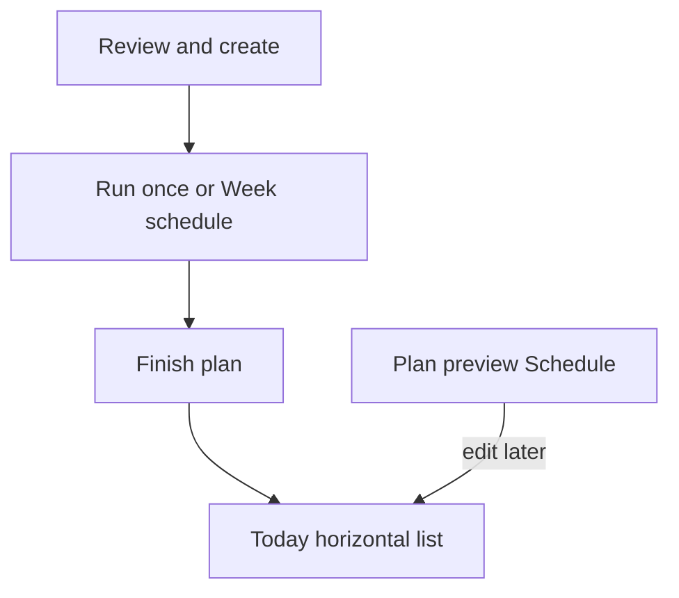

# Today and schedule

Product rules for **which plans feed Today**, **how a plan advances**, **rest**, and the **horizontal Today list**. Implementing agents treat this as the source of truth for schedule behavior. Cross-links: [product-plan.md](product-plan.md), [user-journey.md](user-journey.md), [plan-builder-stepper.md](plan-builder-stepper.md).

## Why this exists

Today currently picks the **newest** startable **active** plan and always wraps day order. That confuses “builder finished” with “I am following this plan,” and it invents a silent **Repeat** loop with no rest and no weekday map.

## Locked decisions

- **Two schedule modes only:** `once` | `week`. There is **no** separate Repeat mode. Wanting the plan to recur means choosing **Week schedule**.
- **Choose schedule while making the plan** (Review & create, before **Finish plan**). Edit later on Plan preview → Schedule.
- **On schedule** (bool) is separate from `draft` / `active`. Only on-schedule active plans feed Today.
- Multi-plan Today: **horizontal list** of every due item (workout and rest tiles).
- Rest is first-class (see below).
- One simple reminder: toggle + time; fires only when ≥1 **workout** is due.

## Status vs schedule (two axes)

| Concept | Meaning |
| --- | --- |
| `draft` / `active` | Build readiness. Drafts cannot start. Unchanged. |
| `onSchedule` | Participates in Today. User-controlled. Default **on** when finishing or installing a starter. |

Turning **On schedule** off parks a finished plan in the library without deleting it.

## Schedule modes (not three)

### Run once (`once`)

Ordered days. Advance to the next incomplete day after each completed session for that plan. After the last day is done → plan is **finished** (off Today, or show Completed on Plan preview). Does **not** wrap.

**Not calendar-based.** The next incomplete day is always the due item until the plan finishes — ignoring what weekday it is. Taking a day off in real life does **not** create a Rest tile.

**Rest only if explicit.** Run once may include Rest days in the sequence only when the user adds them (**Add rest day** on Review / Plan preview). We never invent Rest from empty calendar days, gaps between sessions, or “they didn’t train today.”

### Week schedule (`week`)

User maps each plan day to one or more weekdays. The map **repeats every calendar week**. That is the only recurring mode.

- A weekday with a mapped **workout** day → that workout is due.
- A weekday with a mapped **Rest** day → Rest tile for that plan.
- A weekday with **no** mapping → rest for that plan (no day row required). **This inferred rest is OK for Week only** — show empty slots as Rest on the week strip.

Do **not** also offer “Repeat: after last day, start over.” That duplicates Week schedule badly and hides rest.

## Rest

| Mode | How rest is known | How we show it |
| --- | --- | --- |
| **Week** | Unmapped weekdays (and optional explicit Rest days on the map) | Gray **Rest** on the week strip + Today Rest tile. No need to ask “add rest day” for gaps. |
| **Run once** | **Only** explicit Rest days in the day list | Rest row in the sequence + Today Rest tile when that Rest day is the next incomplete day. **Never** infer rest from the calendar. |

1. **Explicit Rest days** (`kind: rest`, no blocks) — required for rest in `once`; optional on `week`.
2. **Empty weekdays** — **`week` only.** Forbidden as a rest signal for `once`.
3. **Today Rest tile** — when a plan’s due item is an explicit Rest day, or when a **week** plan has no workout mapped today. Do **not** show a Rest tile for an `once` plan merely because the user skipped a calendar day; keep showing the next incomplete workout (or explicit Rest) until finished.

Actions on a Rest tile: **Rested** (marks the rest slot done for `once` advancement / ack for `week`) and optional **Train anyway** (does not skip the slot unless they mark rest done).

Reminders: **workout due only**, never rest-only.

## Where the user sets this

### While creating (required)

On **Review & create**, before **Finish plan**:

1. **On schedule** toggle (default on).
2. **How you follow this plan:** **Run once** | **Week schedule** (exactly one).
3. If **Week schedule:** weekday map for each day (Finish stays disabled until every workout day has ≥1 weekday). Empty weekdays are rest (shown on the strip).
4. If **Run once:** optional **Add rest day** to insert Rest into the sequence. Skipping this means the plan has **no** rest days — Today will only show workout days until finished.

Starters: land as **On schedule + Week schedule** with a sensible default map (e.g. Beginner 2-day: Day A Mon+Thu, Day B Tue+Fri — or Mon/Thu only; document the chosen defaults in product-plan). No silent infinite wrap without a calendar.

### After create (edit)

Plan preview → **Schedule** section: same controls. **Add rest day** matters most for **Run once** (only way to get Rest in that mode). On Week, gaps already read as Rest. Progress block lives on the same preview (see below).

## Today decision maker

Inputs: on-schedule active plans + completed sessions + schedule mode + week map + clock.

Per plan, compute today’s item (or none):

- **`once`:** next incomplete day in order (workout or explicit Rest); if none left → not due (finished). Ignore the calendar.
- **`week`:** days mapped to today’s weekday; if none → that plan contributes **inferred** rest (Week only).

Aggregate:

| Situation | UI |
| --- | --- |
| 0 on-schedule plans | Banner: Import / New / Beginner — no fake Today |
| Only `week` plans with no workout mapped today (and/or explicit Rest due) | Horizontal Rest tile(s) (or one aggregated Rest card) |
| `once` plan still in progress | Always show its next incomplete day (workout Start, or Rest only if that day is an explicit Rest) — never a calendar-inferred Rest |
| ≥1 workout due | Horizontal list: one card per due workout (+ Week rest tiles if another plan is resting) |

One in-progress session rule unchanged (conflict dialog on start).

## Per-plan progress + charts

On Plan preview (below Schedule / days):

- Completion for current `once` run, or adherence for current week on `week`
- Last trained
- Plan-scoped exercise trends + simple charts (weight over sessions; weekly volume/session count)

Month tab stays the **cross-plan** calendar.

## Notifications

- Settings: one **Workout reminder** toggle + time (default 07:00 local)
- Local notification only
- Fire only if Today has ≥1 **workout** due

## Data fields (add to product-plan)

On `WorkoutPlan` (names illustrative):

- `onSchedule: bool`
- `scheduleMode: once | week`
- `weekdayMap: List<{ dayId, weekdays: List<int> }>` (used when `week`; Mon=1…Sun=7 or app convention)
- Optional reminder prefs are **app-level**, not per plan: `reminderEnabled`, `reminderTimeLocal`

On `PlanDay`:

- `kind: workout | rest`

Migration: existing active plans → `onSchedule: true`, `scheduleMode: week`, map days in order onto Mon… until days run out (or product picks starter-like defaults); do **not** migrate to a silent Repeat enum.

## Implementation phases (follow-on agent)

1. **Model + migration** — fields above; migrate active plans to on-schedule + week defaults
2. **Today engine** — multi-due list; rest vs workout; empty banner; drop newest-active wrap
3. **Schedule on Review + Plan preview** — once|week, map, onSchedule, Add rest day
4. **Per-plan Progress + charts**
5. **Reminder** — workout-due only
6. **Tests + journey / patrol** updates

## Out of scope

- Multiple concurrent live sessions
- Smart load / target weight
- Per-day reminder times
- Accounts / sync changes
