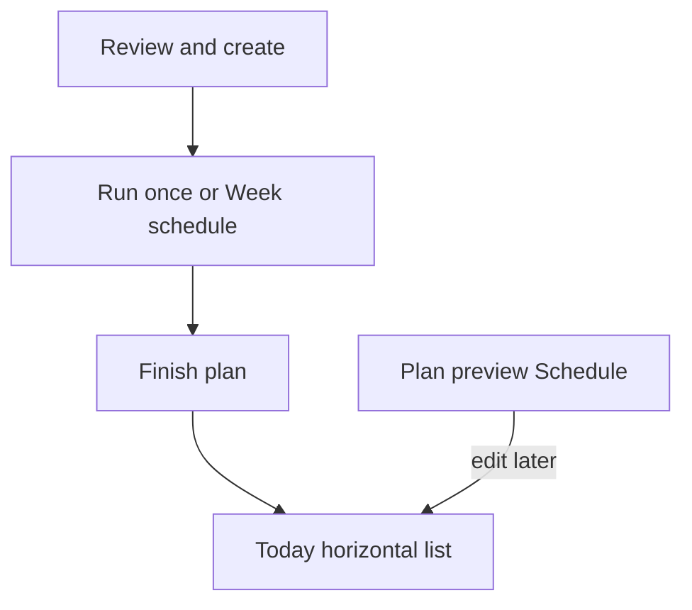

# Today and schedule

Product rules for **which plans feed Today**, **how a plan advances**, **rest**, and the **horizontal Today list**. Implementing agents treat this as the source of truth for schedule behavior. Cross-links: [product-plan.md](product-plan.md), [user-journey.md](user-journey.md), [plan-builder-stepper.md](plan-builder-stepper.md).

## Why this exists

Today currently picks the **newest** startable **active** plan and always wraps day order. That confuses “builder finished” with “I am following this plan,” and it invents a silent **Repeat** loop with no rest and no weekday map.

## Locked decisions

- **Two schedule modes only:** `once` | `week`. There is **no** separate Repeat mode. Wanting the plan to recur means choosing **Week schedule**.
- **Choose schedule while making the plan** (Review & create, before **Finish plan**). Edit later on Plan preview → Schedule.
- **On schedule** (bool) is separate from `draft` / `active`. Only on-schedule active plans feed Today.
- Multi-plan Today: **horizontal list** of every due item.
- **Rest is Week-only.** Empty weekdays are Rest. There is **no Add rest day** control — the app does not offer a way to insert Rest days into a plan.
- **Run once has no Rest.** Workout sequence only until finished.
- **Skip day** is allowed on a due **workout** card (both modes). Skip ≠ Rest.
- One simple reminder: toggle + time; fires only when ≥1 **workout** is due.

## Status vs schedule (two axes)

| Concept | Meaning |
| --- | --- |
| `draft` / `active` | Build readiness. Drafts cannot start. Unchanged. |
| `onSchedule` | Participates in Today. User-controlled. Default **on** when finishing or installing a starter. |

Turning **On schedule** off parks a finished plan in the library without deleting it.

## Schedule modes (not three)

### Run once (`once`)

Ordered **workout** days only. Advance to the next incomplete workout after each completed session for that plan. After the last day is done → plan is **finished** (off Today, or show Completed on Plan preview). Does **not** wrap.

**Not calendar-based.** The next incomplete workout is always the due item until the plan finishes — ignoring what weekday it is.

**No rest in this mode.** No Rest tiles, no Rest rows, no **Add rest day**. To pass a workout without logging it, use **Skip day** (advances the pointer).

### Week schedule (`week`)

User maps each plan day to one or more weekdays. The map **repeats every calendar week**. That is the only recurring mode — and the **only** mode that shows Rest.

- A weekday with a mapped **workout** day → that workout is due.
- A weekday with **no** mapping → **Rest** for that plan (no day row). Show empty slots as Rest on the week strip.

Do **not** also offer “Repeat: after last day, start over.” That duplicates Week schedule badly and hides rest.

## Rest

Rest is a **Week schedule** concept only. There is no way (and no need) to “add a rest day” as a plan day.

| Mode | How rest is known | How we show it |
| --- | --- | --- |
| **Week** | Unmapped weekdays | Gray **Rest** on the week strip + Today Rest tile |
| **Run once** | — | **No Rest.** Workout sequence only until finished |

Today Rest tile: only for a **week** plan with no workout mapped today. Never for Run once.

Reminders: **workout due only**, never rest-only.

## Skip day

Secondary action on a **Today workout card** (not on Rest tiles): **Skip day**.

Skip means “I’m not doing this workout” — no session is logged. It is **not** Rest (Rest = Week empty weekday).

| Mode | What Skip does | Progress |
| --- | --- | --- |
| **Run once** | Marks that plan day **skipped** and advances to the next incomplete workout (same as completing for pointer purposes). If it was the last day → plan finished. | List shows Done / Skipped / Left. Headline e.g. `2 of 4 done · 1 skipped`. Completion % uses **done / total** (skips are not “done”). |
| **Week** | Marks today’s mapped workout **skipped for that calendar date**. That slot is no longer due today. | Week strip shows Skipped on that day. Headline e.g. `This week: 2 trained · 1 skipped · 0 left` among mapped workout days. Adherence = trained / mapped; skips are labeled, not counted as trained. |

After Skip on Once, Today may show the **next** workout the same day (like “Next up” after already training). After Skip on Week, that plan contributes nothing else today unless another weekday mapping applies (it doesn’t on the same date).

No undo required in v1 (keep simple). Skips are stored as lightweight records (`planId`, `dayId`, `date` UTC day) — not workout sessions.

## Where the user sets this

### While creating (required)

On **Review & create**, before **Finish plan**:

1. **On schedule** toggle (default on).
2. **How you follow this plan:** **Run once** | **Week schedule** (exactly one).
3. If **Week schedule:** weekday map for each day (Finish stays disabled until every workout day has ≥1 weekday). Empty weekdays are Rest on the strip.
4. If **Run once:** no rest UI — day list stays workouts only.

Starters: land as **On schedule + Week schedule** with a sensible default map (e.g. Beginner 2-day: Day A Mon+Thu, Day B Tue+Fri — or Mon/Thu only; document the chosen defaults in product-plan). No silent infinite wrap without a calendar.

### After create (edit)

Plan preview → **Schedule** section: same controls (On schedule, once|week, weekday map). **No Add rest day.** Progress block lives on the same preview (see below).

## Today decision maker

Inputs: on-schedule active plans + completed sessions + schedule mode + week map + clock.

Per plan, compute today’s item (or none):

- **`once`:** next workout day that is neither **completed** nor **skipped** in order; if none left → not due (finished). Ignore the calendar. Never emit Rest.
- **`week`:** days mapped to today’s weekday; if that day was **skipped today** → not due; if none mapped → **Rest**.

Aggregate:

| Situation | UI |
| --- | --- |
| 0 on-schedule plans | Banner: Import / New / Beginner — no fake Today |
| Only `week` plans with no workout mapped today | Horizontal Rest tile(s) (or one aggregated Rest card) |
| `once` plan still in progress | Next uncompleted/unskipped workout — Start + **Skip day**; never a Rest tile for that plan |
| ≥1 workout due | Horizontal list: one card per due workout with Start + **Skip day** (+ Week Rest tiles if another plan has an empty weekday today) |

One in-progress session rule unchanged (conflict dialog on start).

## Per-plan progress + charts

On Plan preview (below Schedule / days):

- **Once:** `N of M done` plus skipped count; day list Done / Skipped / Left
- **Week:** this week trained / skipped / remaining among mapped workout days; week strip marks trained, skipped, Rest (empty)
- Last trained
- Plan-scoped exercise trends + simple charts (weight over sessions; weekly volume/session count)

Month tab stays the **cross-plan** calendar. Skips do not create Month dots (no session).

## Notifications

- Settings: one **Workout reminder** toggle + time (default 07:00 local)
- Local notification only
- Fire only if Today has ≥1 **workout** due

## Data fields (add to product-plan)

On `WorkoutPlan` (names illustrative):

- `onSchedule: bool`
- `scheduleMode: once | week`
- `weekdayMap: List<{ dayId, weekdays: List<int> }>` (used when `week`; Mon=1…Sun=7 or app convention)
- Optional reminder prefs are **app-level**, not per plan: `reminderEnabled`, `reminderTimeLocal`

Skip records (collection or embedded list; names illustrative):

- `planId`, `dayId`, `date` (UTC calendar day of the skip)

Plan days stay workout prescriptions for v1 schedule UX. Week Rest comes from empty weekday slots, not from Rest day rows. (No `DayKind.rest` required for this design.)

Migration: existing active plans → `onSchedule: true`, `scheduleMode: week`, map days in order onto Mon… until days run out (or product picks starter-like defaults); do **not** migrate to a silent Repeat enum.

## Implementation phases (follow-on agent)

1. **Model + migration** — schedule fields + skip records; migrate active plans to on-schedule + week defaults
2. **Today engine** — multi-due list; Week Rest vs workout; Skip day; empty banner; drop newest-active wrap; Once never emits Rest
3. **Schedule on Review + Plan preview** — once|week, map, onSchedule (no Add rest day)
4. **Per-plan Progress + charts** (including skipped)
5. **Reminder** — workout-due only
6. **Tests + journey / patrol** updates

## Out of scope

- Multiple concurrent live sessions
- Smart load / target weight
- Per-day reminder times
- Accounts / sync changes
- Explicit Rest day rows / **Add rest day** UI
- Undo skip / edit skip history UI
